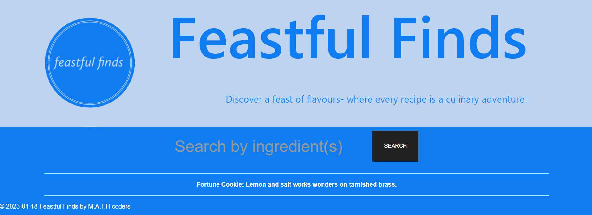

# Feastful Finds

## Table of Contents
* [About](#about)
* [Screenshot](#screenshot)
* [Link](#link)

## About
--------------------------------------------------------------------------------------------------------------------------------------------------------
"Feastful Finds" is a recipe website that aims to make meal planning and preparation a breeze. With our easy-to-use platform, you can enter the ingredients you have on hand and receive a variety of recipe ideas that will help you make the most of what you already have. No more waste, no more searching for the perfect recipe, just delicious meals that you can make quickly and easily. 

This website was created using html, css framework Uikit and javascript by M.A.T.H coders which are Mathieu Dubois, Abenezer Mengesha, Haozhe Huang and Terianne Phillips. 

It uses two API's, one that gives a fortune cookie called Advise Slip - a cute little snippet of random advise and the second is the main API for the recipes called Spoonacular. 

Local storage is used to store the recipe id so that that recipe can be pulled and rendered to the recipe.html page.

## Screenshot
--------------------------------------------------------------------------------------------------------------------------------------------------------

## Link
-------------------------------------------------------------------------------------------------------------------------------------------------------
Visit the site! [Feastful Finds](https://teriannephillips.github.io/Feastful-Finds)